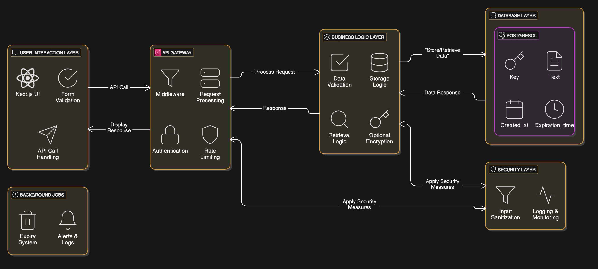

# DevSync - Encrypted Code & Text Sharing



## Overview  
**DevSync** is a secure and encrypted code/text-sharing platform designed for developers and teams. Built with a layered architecture, it ensures privacy, real-time access, and efficient handling of data.

## 🏗 Architecture Overview  
The system is designed using a modular approach with different layers handling specific responsibilities.

### **1️⃣ User Interaction Layer**
- **Next.js UI** – Modern, responsive frontend for user interaction.
- **Form Validation** – Ensures proper input before submission.
- **API Call Handling** – Manages communication with the backend.

### **2️⃣ API Gateway**
- **Middleware** – Processes incoming requests.
- **Request Processing** – Handles incoming API calls.
- **Authentication** – Secure access control.
- **Rate Limiting** – Prevents abuse and excessive usage.

### **3️⃣ Business Logic Layer**
- **Data Validation** – Ensures data integrity before storing.
- **Storage Logic** – Manages how data is written to the database.
- **Retrieval Logic** – Handles fetching of stored data.
- **Optional Encryption** – Encrypts stored snippets for enhanced security.

### **4️⃣ Database Layer**
- **PostgreSQL** – Stores encrypted text/code snippets.
- **Schema:**
  - `Key` – Unique identifier for each snippet.
  - `Text` – Encrypted or raw text data.
  - `Created_at` – Timestamp of snippet creation.
  - `Expiration_time` – Auto-deletion schedule for snippets.

### **5️⃣ Security Layer**
- **Input Sanitization** – Prevents SQL injection and XSS attacks.
- **Logging & Monitoring** – Tracks system activity for security and debugging.

### **6️⃣ Background Jobs**
- **Expiry System** – Removes expired snippets automatically.
- **Alerts & Logs** – Monitors system health and security events.

## 🚀 Features  
✅ **End-to-End Encryption** for private sharing  
✅ **Self-destructing Snippets** with expiration controls  
✅ **Real-time API for developers**  
✅ **Secure & Scalable PostgreSQL Backend**  

## 📜 How It Works  
1. User submits code/snippet via the **Next.js UI**.  
2. The **API Gateway** authenticates and processes the request.  
3. The **Business Logic Layer** validates and optionally encrypts data.  
4. Snippet is stored securely in **PostgreSQL** with an expiration time.  
5. Expired snippets are deleted automatically via **background jobs**.  

## 📌 Setup  
To deploy **DevSync**, follow these steps:  
```bash
git clone https://github.com/your-repo/devsync.git
cd devsync
docker-compose up -d
```

## 🛠 Tech Stack  
- **Frontend:** Next.js  
- **Backend:** Node.js, Express.js  
- **Database:** PostgreSQL  
- **Security:** JWT Authentication, Input Sanitization  
- **Hosting:** Docker, Cloud Deployment  

## 🤝 Contributing  
Contributions are welcome! Feel free to open an issue or submit a pull request.

## 📄 License  
This project is licensed under the MIT License.  
